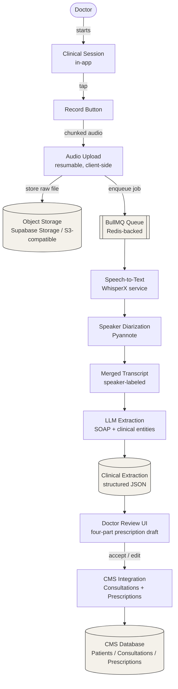
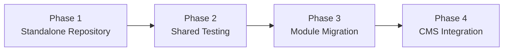
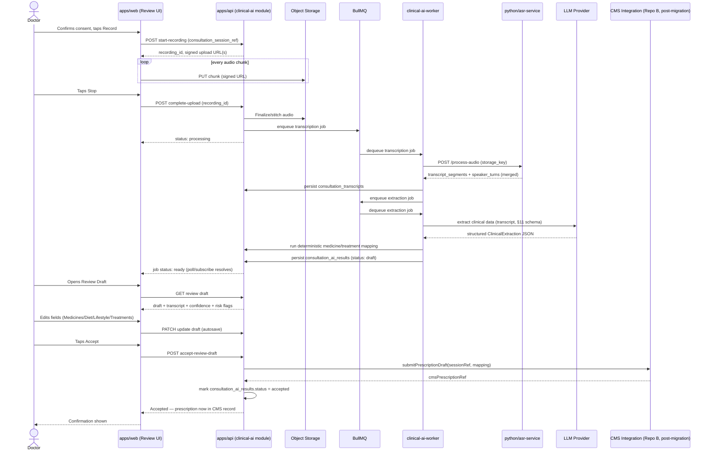

# Clinical AI Module — Architecture & Development Blueprint

**Status:** Original planning document, written before any code
existed. Kept as the source of truth for structure/conventions and
updated in place where a real decision has materially diverged (see
the "Materially updated" / "Superseded" callouts throughout — §3, §7,
§8, §9, §11, §12, §13 all have one). For the current, accurate,
detailed description of how the pipeline actually runs today —
chunking mechanics, exactly how transcription and extraction work,
end-to-end flow — see **`docs/modules/clinical-ai-pipeline.md`**
instead of trying to reconstruct it from this document's original
design intent.
**Target repo name:** `kal-scribe`
**Author context:** Kerala Ayurveda CMS engineering. Repo A = current production CMS (Next.js/Supabase). Repo B (`C:\KAL_CMS`) = future-architecture CMS (Next.js 16 + NestJS 11 + Postgres + Drizzle + BullMQ + Redis, pnpm workspace, modular monolith, Clean Architecture / DDD-inspired). This document was written after inspecting Repo B's actual source tree, not just its stack description, so folder names, file-naming conventions, and infra choices below are traced to real files in Repo B (cited inline as `repo B: <path>`).

---

## 1. Vision

### The problem

A doctor's highest-value activity — the consultation — currently produces zero structured data unless the doctor manually types it. Today's flow is: doctor talks to patient, doctor remembers or scribbles notes, doctor later opens the CMS and hand-types the consultation, diagnosis, and prescription (Medicines / Diet / Lifestyle / Treatments). This is slow, lossy, and puts documentation burden on the person whose time is most expensive. It also means the CMS's clinical data quality is only as good as what a rushed doctor chooses to type after the fact.

The Clinical AI module automates the documentation step: record the doctor–patient conversation, transcribe it, identify who said what, extract clinical meaning (chief complaint, symptoms, diagnosis, medicines mentioned, advice, follow-up), draft it into the CMS's existing prescription shape, and hand the doctor a reviewable draft instead of a blank form.

### Why it exists as a separate repository

1. **Different velocity and risk profile.** This module iterates on ML pipeines (STT models, diarization tuning, prompt/schema iteration for extraction) — a much faster, more experimental release cadence than clinical workflow code, which must be conservative and change-controlled (it touches PHI and billing-adjacent logic like prescriptions).
2. **Different runtime shape.** It needs a Python execution environment for speech/diarization models (WhisperX, Pyannote), a queue-worker topology for long-running audio jobs, and — eventually — GPU-backed inference. Bolting this onto Repo A's Vercel/Supabase serverless model, or prematurely onto Repo B while its own migration is mid-flight, adds risk to both.
3. **Independent testability.** The hardest part of this system (transcription accuracy, diarization correctness, extraction schema fidelity) can and should be evaluated against recorded audio fixtures completely independent of any clinic workflow. Coupling it to the CMS repo would force every AI-pipeline experiment through the CMS's test suite and deploy pipeline.
4. **Clean seam for a reversible bet.** Speech-to-text and LLM vendor choices are exactly the kind of decision you want to be able to change without a repo migration. A separate repo with a narrow integration contract (see §17) makes "swap Whisper for Google STT" or "swap Groq for Claude" a change inside one repo, not a cross-cutting CMS change.

### Why it follows Repository B's architecture, not Repository A's or something new

Repo A is the *current* production shape and is explicitly being superseded. Building a new module against it would mean migrating the module a second time when Repo B goes live. Repo B is not fully built yet, but its conventions are already established and consistent (verified against the live tree: `apps/{api,web}`, `packages/{types,validation,config,ui}`, NestJS modules with `domain/application/infrastructure/presentation`, Next.js features with `components/hooks/services/schemas/types`, BullMQ queues under `infrastructure/queues/`, Drizzle against Postgres, pnpm workspace). Mirroring these conventions exactly means:

- Zero architectural translation cost when this module is copied into Repo B (§16–17).
- The Panchakarma-builder mistake — "already built, don't rebuild it, just move it" (per CLAUDE.md) — is not repeated. This module is designed from day one to be *moved*, not rewritten, into Repo B.
- Engineers who work in Repo B can read this repo's code with zero ramp-up.

### How it eventually integrates into the CMS

Short version (full detail in §17): this repo ships a `clinical-ai` NestJS module and a `clinical-ai` Next.js feature, built and tested standalone against a stub "CMS-facing" contract (a small set of read/write interfaces: fetch appointment/patient context, submit a prescription draft). When Repo B's own `consultations` and `prescriptions` modules are stable, the `clinical-ai` module folder is copied verbatim into Repo B's `apps/api/src/modules/` and `apps/web/src/features/`, and the stub contract is swapped for real calls into Repo B's `ConsultationsModule` / `PrescriptionsModule`. No rewrite — a folder copy plus one adapter swap.

---

## 2. Goals

### MVP goals

- Doctor can start/stop an audio recording attached to a specific consultation/appointment.
- Audio uploads reliably (resumable, works on flaky clinic wifi) to durable storage.
- Background pipeline: transcription (speech-to-text) + speaker diarization (Doctor vs Patient) → single merged, speaker-labeled transcript.
- LLM extracts a structured clinical record from the transcript (see §11 schema) including a SOAP note, medicines mentioned, diet/lifestyle/treatment mentions, follow-up, and risk flags.
- Doctor reviews the AI draft in a screen that mirrors the CMS's existing four-part prescription UI (Medicines / Diet / Lifestyle / Treatments), edits inline, and accepts — at which point it becomes a normal CMS prescription (via the integration contract, not a direct DB write from this repo).
- Every AI-touched field is clearly marked "AI-suggested, doctor-reviewed" until accepted; nothing reaches the patient or the record unedited-and-unreviewed.
- Full audit trail: raw audio retained per policy (§14), transcript stored, every AI job's inputs/outputs versioned.
- Works for English and code-switched English/Malayalam/Hindi consultations at "usable draft" quality — not perfection; the doctor is always the final editor.

### Future goals

- Realtime/streaming transcription and live SOAP-note drafting during the consultation (§19).
- Doctor-specific voice fingerprinting to auto-label speakers without relying purely on diarization heuristics.
- Cross-consultation patient timeline / trend analysis (symptom progression, adherence signals).
- Multi-language expansion beyond the MVP set.
- Ayurveda-specific structured extraction (dosha assessment mentions, Panchakarma-relevant signals) feeding into the existing PK Protocol Builder.
- Fine-tuned or distilled small models to cut inference cost once volume justifies it.

### Non-goals (v1)

- Not a general-purpose transcription product — scope is strictly doctor–patient clinical consultations.
- Not a diagnosis engine. The LLM extracts what was *said*; it does not infer a diagnosis the doctor didn't state (see §11 — diagnosis field is populated only if explicitly stated).
- No billing, inventory, or payment logic (matches CLAUDE.md's CMS-wide v1 scope exclusion).
- No Periskope/WhatsApp-group integration (explicitly out of scope until the CMS's own Periskope phase begins, per CLAUDE.md rule — this module never talks to Periskope or Limechat directly; any patient-facing notification triggered by a completed prescription stays owned by the CMS's existing scheduler).
- No autonomous prescribing — the module never writes a prescription without an explicit doctor "Accept" action.
- No real-time transcription in v1 (post-hoc processing only; see §19 for the future path).

---

## 3. Overall Architecture

> **Diagram/topology below is the original pre-build design.** The
> deployed default today: Gemini handles both STT and diarization in
> one call (ADR-0013), Redis/BullMQ is pg-boss (ADR-0015), and object
> storage is Supabase (ADR-0014) rather than a generic
> "S3-compatible" choice. See `docs/modules/clinical-ai-pipeline.md`
> for the current, accurate flow diagram and stage-by-stage detail.

### 3.1 System context



### 3.2 Runtime topology

Three deployable units, one shared Postgres/Redis:

| Unit | Runtime | Responsibility |
|---|---|---|
| `apps/api` (NestJS) | Node 22, containerized | HTTP API, auth, job orchestration (BullMQ producers), consultation-AI domain logic, CMS integration adapters |
| `apps/web` (Next.js) | Node 22, Vercel or containerized | Recording capture UI, review/edit UI, doctor-facing screens |
| `python/asr-service` (FastAPI) | Python 3.11, GPU-capable container | Stateless inference microservice: speech-to-text, diarization, alignment. Called by NestJS job workers over internal HTTP. Not a BullMQ consumer itself in v1 (see §13). |

Everything else (Postgres via Drizzle, Redis via BullMQ, object storage) is infrastructure, not a separate deployable.

### 3.3 Why the Python service is *called*, not *merged* into the Node process

Whisper/WhisperX and Pyannote are Python-only, GPU-friendly, and have their own dependency/version sensitivity (torch, CUDA). Keeping them behind a narrow internal HTTP contract (`POST /transcribe`, `POST /diarize`, or a combined `POST /process-audio`) means:

- The Node side never touches Python packaging.
- The inference service can be scaled/GPU-provisioned independently of the API.
- It is swappable per §8's provider-independence requirement without touching NestJS code — only the adapter in `infrastructure/` changes.

---

## 4. Repository Structure

Following Repo B's actual pnpm-workspace layout (`repo B: pnpm-workspace.yaml` → `apps/*`, `packages/*`), extended with the two elements Repo B doesn't need yet: a `workers/` split for long-running job processors and a `python/` service.

```
kal-scribe/
├── apps/
│   ├── api/                        # NestJS — orchestration, domain logic, CMS integration
│   │   └── src/
│   │       ├── modules/
│   │       │   └── clinical-ai/    # see §5 — the one module this repo is really about
│   │       ├── infrastructure/     # queues/, database/, env/, logging/, monitoring/ (mirrors repo B 1:1)
│   │       └── shared/
│   └── web/                        # Next.js — recording capture + review UI
│       └── src/
│           ├── app/                 # route handlers/pages (App Router)
│           ├── features/
│           │   └── clinical-ai/     # see §6
│           ├── lib/
│           └── providers/
├── workers/
│   └── clinical-ai-worker/          # BullMQ worker process(es) — separate deployable from apps/api's
│                                    # HTTP server, so a stuck transcription job can't starve API latency
├── python/
│   └── asr-service/                 # FastAPI: STT + diarization + alignment. Own Dockerfile, own deps.
│       ├── app/
│       │   ├── main.py
│       │   ├── stt/                 # provider adapters (whisperx.py, google_stt.py, ...)
│       │   ├── diarization/          # pyannote.py
│       │   └── schemas/              # pydantic request/response models mirroring packages/types
│       ├── tests/
│       └── pyproject.toml
├── packages/
│   ├── types/                       # shared TS types: TranscriptSegment, ClinicalExtraction, JobStatus...
│   ├── validation/                  # zod schemas — one file per bounded concept (mirrors repo B's
│   │                                #   `*.schema.ts` per-domain-file convention)
│   ├── config/                      # env parsing (mirrors repo B's parseApiEnv pattern)
│   └── ui/                          # only if the review UI needs shared primitives beyond app/web/features
├── docs/
│   ├── README.md                    # explains the doc types below and when each one updates
│   ├── architecture.md              # this document, copied in at repo setup — source of truth for
│   │                                #   structure/conventions; updated only when the plan itself changes
│   ├── PROJECT_STATUS.md            # rewritten in place after every task — one-glance current state:
│   │                                #   what's built, in progress, not started, known issues, next up
│   ├── log/                         # append-only, dated diary — one file per completed task
│   │                                #   (YYYY-MM-DD-<slug>.md), never edited after the fact
│   ├── modules/                     # living per-module docs, rewritten (not appended) as a module's
│   │                                #   design meaningfully changes — captures drift from this plan
│   ├── adr/                         # architecture decision records, one per non-obvious call (STT vendor,
│   │                                #   LLM vendor, schema versioning) — mirrors repo B's docs/adr-*.md
│   ├── design/                      # copy of the CMS's brand/UI standard — ui-guidelines.md, ui-reference.md,
│   │                                #   Logos/ — see §6's "Visual consistency" note; kept in sync with the
│   │                                #   source CMS repo's context/ui guidelines/, not forked/reinvented
│   ├── clinical-extraction-schema.md
│   └── runbooks/
├── tests/
│   ├── fixtures/
│   │   └── audio/                   # de-identified or synthetic sample consultations for pipeline eval
│   ├── e2e/                         # Playwright: record → review → accept flow
│   └── eval/                        # transcription/extraction accuracy harness (not unit tests — see §18)
├── infrastructure/
│   ├── docker/                      # docker-compose for local Postgres/Redis/asr-service
│   └── scripts/
├── pnpm-workspace.yaml
├── package.json
├── tsconfig.base.json
└── CLAUDE.md                        # this repo's own contributor rules — see §20
```

**Every folder's job, one line each:**

- `apps/api` — the only thing allowed to talk to Postgres, Redis, or the CMS integration contract. All business rules live here.
- `apps/web` — the only thing the doctor's browser talks to. No direct DB or storage access; everything goes through `apps/api`.
- `workers/clinical-ai-worker` — runs the BullMQ job processors (`Processor` classes) that do transcription/diarization/extraction orchestration. Deployed and scaled separately from `apps/api`'s HTTP server (§13).
- `python/asr-service` — the only thing that imports torch/whisper/pyannote. Stateless: given audio in, transcript+diarization out.
- `packages/types` — TypeScript types shared between `apps/api` and `apps/web` (and mirrored, field-for-field, into the Python service's Pydantic models — see §16 on keeping these in sync).
- `packages/validation` — zod schemas for every request/response boundary; same pattern as Repo B's `packages/validation/src/*.schema.ts`.
- `packages/config` — typed env parsing, one function per app, same pattern as Repo B's `@cms/config` (`parseApiEnv`).
- `docs/PROJECT_STATUS.md` — rewritten in place after every task, not appended to. The one-glance answer to "what state is this repo in right now" — what's built, what's in progress, what's not started, known issues, next up. This is the file you'd paste into another tool/session to hand off context.
- `docs/log/` — append-only, dated diary (`YYYY-MM-DD-<slug>.md`, one file per completed task). Never edited after the fact — if something needs correcting, a new entry references the old one. This is the history `PROJECT_STATUS.md` deliberately doesn't keep.
- `docs/modules/` — living per-module docs, rewritten (not appended) as a module's actual design drifts from what this document specifies. Only written when reality diverges from this plan — it should stay mostly empty if the plan holds.
- `docs/adr` — every "why did we pick X" decision (STT vendor, LLM vendor, retention window) gets one file. This is what makes the eventual CMS integration reviewable instead of archaeological.
- `tests/eval` — a *separate* thing from `tests/e2e` and unit tests: a harness that runs the pipeline against a fixed audio fixture set and reports transcription WER / extraction field-accuracy over time, so a model or prompt change has a measurable before/after (see §18, Milestone 7).

**Keeping `docs/` current is not optional busywork** — it's how context survives across sessions and across people (including a non-technical PM who wasn't in the room for an implementation decision). The exact update rule (update `PROJECT_STATUS.md` and append a `log/` entry after every completed task, without being asked) lives in this repo's own `CLAUDE.md`, not in this document — because it's a standing behavioral instruction for whoever/whatever works in the repo, not part of the architecture itself. Set `docs/` up from the template at Milestone 1 (§18) so the convention is live from the very first task, not retrofitted later.

---

## 5. Backend Architecture — `modules/clinical-ai/`

Following Repo B's module shape exactly (verified against `repo B: apps/api/src/modules/{consultations,notifications}/*`, which use `domain/`, `application/`, `infrastructure/`, `presentation/`, plus one `<module>.module.ts` at the module root).

```
apps/api/src/modules/clinical-ai/
├── clinical-ai.module.ts
├── domain/
│   ├── consultation-recording.entity.ts
│   ├── clinical-extraction.entity.ts
│   ├── transcript.types.ts
│   ├── extraction-confidence.engine.ts     # confidence scoring / risk-flag rules — pure logic, no I/O
│   └── clinical-ai.types.ts
├── application/
│   ├── start-recording.use-case.ts
│   ├── complete-upload.use-case.ts
│   ├── process-transcription.use-case.ts
│   ├── process-diarization.use-case.ts
│   ├── run-clinical-extraction.use-case.ts
│   ├── get-review-draft.use-case.ts
│   ├── update-review-draft.use-case.ts
│   ├── accept-review-draft.use-case.ts      # this is the one use-case that calls the CMS integration port
│   ├── clinical-ai-policy.service.ts         # consent checks, role checks (doctor-only), retry policy
│   └── clinical-ai-event-bus.service.ts      # mirrors notifications module's event-bus pattern
├── infrastructure/
│   ├── consultation-recording.repository.ts
│   ├── clinical-extraction.repository.ts
│   ├── asr-service.adapter.ts                 # HTTP client to python/asr-service
│   ├── llm-provider.adapter.ts                # see §10 — provider-abstracted
│   ├── storage.adapter.ts                     # Supabase Storage / S3 signed URLs
│   ├── cms-integration.adapter.ts             # the ONE seam into the rest of the CMS (§17)
│   └── clinical-ai.fixture.ts                 # test fixtures, mirrors repo B's `*.fixture.ts` convention
└── presentation/
    ├── clinical-ai.controller.ts               # doctor-facing REST endpoints
    └── admin-clinical-ai.controller.ts          # admin: reprocess job, view raw transcript, audit
```

### Layer responsibilities (why each exists, not just what it holds)

- **`domain/`** — pure business rules with zero I/O and zero framework imports. `extraction-confidence.engine.ts` decides "is this extraction confident enough to show without a warning banner" — that's a business rule, testable with plain objects in, plain objects out, no mocks needed. This mirrors `repo B: consultations/domain/consultation-status.engine.ts` exactly.
- **`application/`** — use-cases: one file per user-triggered or system-triggered action, orchestrating domain + infrastructure. `accept-review-draft.use-case.ts` is the single place that: (1) validates the doctor's edits, (2) calls `cms-integration.adapter.ts` to actually create the CMS prescription, (3) marks the extraction record as `accepted`, (4) emits a domain event. No controller and no repository does this directly — it's the one place this logic can live, so it can be tested without an HTTP layer.
- **`infrastructure/`** — everything that talks outside the process: DB (via Drizzle repositories), the Python ASR service (HTTP), the LLM provider (HTTP), object storage (Supabase Storage SDK / S3 SDK), and — critically — `cms-integration.adapter.ts`, which is the *only* file in this entire repo allowed to know about CMS concepts like "Prescription" or "Consultation" as owned by the rest of the system. Everything upstream of this adapter talks in this module's own vocabulary (`ClinicalExtraction`, `ReviewDraft`); everything downstream of it speaks the CMS's contract. This is what makes §17's integration a one-file swap.
- **`presentation/`** — NestJS controllers. Thin: parse request, call one use-case, map response. No business logic, ever (matches this repo's own engineering principle, §20).

### The one deliberate exception: `workers/clinical-ai-worker`

BullMQ `Processor` classes that run `process-transcription.use-case.ts` etc. live in `workers/clinical-ai-worker`, not inside `apps/api/src/modules/clinical-ai/infrastructure/`. They *import* the module's use-cases (the module is a shared NestJS module usable by both the API app and the worker app), but run in a separately deployed process. This avoids a single slow/stuck transcription job blocking the HTTP server's event loop or its own liveness probes — directly relevant given audio jobs can run for minutes (§13).

---

## 6. Frontend Architecture — `features/clinical-ai/`

Following Repo B's feature shape exactly (verified against `repo B: apps/web/src/features/{appointments,consultations}/*` → `components/`, `services/`, `schemas/`, `types/`; `repo B: docs/module-guidelines.md` additionally specifies a `hooks/` folder per feature).

```
apps/web/src/features/clinical-ai/
├── components/
│   ├── RecordButton.tsx              # start/stop/pause recording, visual level meter
│   ├── UploadProgress.tsx            # resumable upload status
│   ├── ReviewDraftPanel.tsx           # container: renders the 4-part draft (Medicines/Diet/Lifestyle/Treatments)
│   ├── TranscriptViewer.tsx           # speaker-labeled transcript, collapsible, source-of-truth reference
│   ├── ConfidenceBadge.tsx            # per-field "AI confidence" indicator
│   ├── RiskFlagBanner.tsx             # surfaces domain.risk_flags prominently
│   └── SoapNoteView.tsx
├── hooks/
│   ├── useAudioRecorder.ts            # MediaRecorder wrapper, chunking, pause/resume
│   ├── useUploadSession.ts            # resumable upload state machine
│   ├── useReviewDraft.ts              # fetch + local edit state for the draft, before accept
│   └── useExtractionJobStatus.ts       # polls/subscribes to job progress (queued/processing/ready/failed)
├── services/
│   ├── recording.service.ts           # calls apps/api clinical-ai.controller endpoints
│   ├── review-draft.service.ts
│   └── job-status.service.ts
├── schemas/
│   ├── review-draft.schema.ts          # zod — validates doctor edits before submit, mirrors packages/validation
│   └── recording-session.schema.ts
├── types/
│   └── clinical-ai.types.ts            # re-exports/narrows packages/types for this feature's own use
└── providers/
    └── ClinicalSessionProvider.tsx     # scopes recording/review state to one consultation session
```

### Why this shape, field by field

- **`components/` vs `hooks/` split** is not cosmetic: `useAudioRecorder` and `useUploadSession` contain browser-API logic (MediaRecorder, chunked fetch/retry) that must be unit-testable without rendering anything. Components stay dumb — they receive state and callbacks from hooks, matching Repo B's existing convention.
- **`ReviewDraftPanel` reuses the CMS's existing prescription UI components where they already exist** (Medicines/Diet/Lifestyle/Treatments editors) rather than re-implementing them — per CLAUDE.md's "follow existing patterns, flag before introducing anything new." In the standalone repo this means building against a *stub* of those shared components (documented in `docs/adr/`) until integration (§17), at which point real imports replace the stub.
- **`ConfidenceBadge` / `RiskFlagBanner` exist as separate components**, not inline styling, because they are the module's core trust mechanism — every AI-suggested field must visually read as "suggested," never as already-authoritative, until the doctor accepts.
- **No direct Supabase/Postgres/Redis access from `apps/web`** — everything routes through `services/*.ts` calling `apps/api`. This matches Repo B's separation and keeps this repo's frontend framework-agnostic of storage/queue choices.

### Visual consistency with the existing CMS — mandatory, not optional

Every screen this module adds (`RecordButton`, `UploadProgress`, `ReviewDraftPanel`, `TranscriptViewer`, `ConfidenceBadge`, `RiskFlagBanner`, `SoapNoteView`) must look like it belongs inside the existing CMS, not like a bolted-on separate product. This repo carries its own local copy of the CMS's brand/UI standard for exactly this reason — `docs/design/ui-guidelines.md` (brand colors, fonts, tone) and `docs/design/ui-reference.md` (concrete component patterns extracted from the existing Panchakarma Builder UI), copied in from the current CMS repo's `context/ui guidelines/` so this repo can be worked on standalone without depending on that repo being open.

**Non-negotiable rule, inherited from the current CMS's own contributor rules:** before building any new UI component in this repo, read both files in `docs/design/` first. Concretely, that means:

- **Colors:** primary `#1E4B3C` (deep forest green), secondary `#F2F5ED` (light sage), accent `#AA832A` (warm gold), background white, text near-black — no new palette introduced for this module's screens.
- **Fonts:** Marcellus for headings, Figtree for body/UI text — same as the rest of the CMS.
- **Tone:** calm, trustworthy, professional, uncluttered — explicitly *not* playful, colourful, or consumer-app-like. A doctor should not be able to tell, from look and feel alone, that `ReviewDraftPanel` is a different codebase than the consultation screen it feeds into.
- **Component patterns:** reuse the patterns already catalogued in `ui-reference.md` (buttons, cards, form fields, badges, etc.) rather than inventing new ones — this is the same reasoning as reusing the actual Medicines/Diet/Lifestyle/Treatments components (above), just applied to lower-level UI primitives too.

Any place this module's UI genuinely needs something the existing guidelines don't cover (e.g. a live audio level meter for `RecordButton`, or the AI-confidence/risk-flag visual language, which is new to this module because nothing like it exists in the CMS today) should be designed as a deliberate, minimal *extension* of the existing look — same colors/fonts/tone, new pattern only where one doesn't already exist — and recorded as an ADR (`docs/adr/`) so it's a documented decision, not silent drift. Keep `docs/design/` in sync with the source CMS repo's `context/ui guidelines/` if that ever changes upstream — it is a copy, not a fork.

---

## 7. AI Pipeline

> **Superseded by the actual implementation — see
> `docs/modules/clinical-ai-pipeline.md` for the current, accurate
> stage-by-stage walkthrough**, including real chunking mechanics (15s
> browser-side segments, why `MediaRecorder`'s `timeslice` mode isn't
> used, ffmpeg stream-copy stitching, the "stop on first 404" chunk-
> count mechanism) and exactly how the LLM extraction call works
> (prompt rules, schema validation/retry, confidence). The stages
> below describe the original two-LLM-pass design; the deployed
> default today is Gemini doing STT+diarization in one audio-native
> call (stage 5–6 below collapse into one), and a single
> extraction call (stage 8–9 below are one call, not two) — ADR-0013.

```mermaid
flowchart LR
    A[Audio Recording\nclient-side chunks] --> B[Upload\nresumable]
    B --> C[Storage\nraw audio, versioned]
    C --> D[Queue\nBullMQ job: transcribe]
    D --> E[Speech-to-Text\nWhisperX]
    E --> F[Speaker Diarization\nPyannote]
    F --> G[Transcript\nmerged, speaker-labeled, timestamped]
    G --> H[Clinical Entity Extraction\nLLM pass 1]
    H --> I[SOAP Generation\nLLM pass 2 or same pass]
    I --> J[Clinical Insights\nrisk flags, confidence scoring]
    J --> K[Prescription Mapping\nmap entities → Medicines/Diet/Lifestyle/Treatments shape]
    K --> L[Review\ndoctor edits in UI]
    L --> M[Save\nCMS integration: create Consultation + Prescription]
```



### Stage-by-stage

1. **Audio Recording.** Browser `MediaRecorder`, chunked (e.g. 15–30s segments) so a crash or connectivity drop loses at most one chunk, not the whole consultation. Chunks tagged with sequence number + session ID.
2. **Upload.** Each chunk uploaded as it completes (not batched at the end) via a resumable upload session — if a chunk fails, only that chunk retries. Final "stop recording" action finalizes the session and triggers stitching server-side.
3. **Storage.** Raw audio (stitched, one file per consultation) written to object storage (§14) under a path keyed by `consultation_recording_id`. Immutable once finalized.
4. **Queue.** A `transcribe-consultation` BullMQ job is enqueued referencing the stored audio's storage key. This is the hand-off point from "real-time-ish client concern" to "durable background pipeline" (§13).
5. **Speech-to-Text.** Worker calls `python/asr-service` with the audio reference. WhisperX produces word-level timestamped transcript segments (§8).
6. **Speaker Diarization.** Same call (or a chained call) runs Pyannote to produce speaker-turn boundaries; merged with STT word timestamps (§9).
7. **Transcript.** The merged, speaker-labeled, timestamped transcript is persisted (`consultation_transcripts`, §12) — this is the durable, human-readable artifact and the input to every downstream LLM step. It is also directly viewable by the doctor (`TranscriptViewer.tsx`) as the ground truth if they distrust an extraction.
8. **Clinical Entity Extraction.** LLM call #1: extract the structured JSON described in §11 from the transcript. Structured-output-constrained (JSON schema) so the result is guaranteed parseable.
9. **SOAP Generation.** Either folded into the same LLM call as step 8 (recommended for MVP — one call, one schema, fewer round trips and no drift between "entities" and "SOAP narrative") or a second pass if evaluation shows quality gains from separating narrative generation from structured extraction. Decision left open in `docs/adr/` pending eval (§18, Milestone 7) — default to single-pass for MVP cost/latency.
10. **Clinical Insights.** Derived, not separately prompted: risk flags (e.g. mentioned medicine conflicting with a known allergy on file — requires a CMS lookup, see §17), and per-field AI confidence (from LLM-reported confidence plus heuristics like "was this field present verbatim in the transcript or inferred").
11. **Prescription Mapping.** Deterministic (non-LLM) mapping step: takes the LLM's `medicines_mentioned` / `diet` / `lifestyle` / `treatments` arrays and maps them onto the CMS's actual prescription data shape (matching existing dropdown/enum values where possible — e.g. resolving a mentioned medicine name to the CMS's medicine master list). This is a domain-layer concern (`domain/`), not an LLM concern — LLMs are unreliable at exact-match-to-existing-enum tasks; a deterministic fuzzy-match/lookup step is more reliable and auditable.
12. **Review.** Doctor opens `ReviewDraftPanel`, sees the four-part draft pre-filled, transcript available alongside, confidence/risk indicators visible, edits anything, and either accepts or discards.
13. **Save.** `accept-review-draft.use-case.ts` calls `cms-integration.adapter.ts` to create the real Consultation/Prescription records in the CMS's system of record. This module's own `clinical_ai_results` row is marked `accepted` and linked to the resulting CMS record ID for traceability.

---

## 8. Speech-to-Text Evaluation

> **Historical evaluation — kept for the reasoning.** Gemini became
> the deployed default for speech understanding (ADR-0013), and the
> WhisperX/Pyannote path this section evaluates was later removed from
> the codebase entirely (ADR-0017) — `python/asr-service` no longer
> exists. See `docs/modules/clinical-ai-pipeline.md` §4 for how the
> current pipeline actually works.

| | Google Speech-to-Text | Whisper (self/API-hosted) | WhisperX |
|---|---|---|---|
| **Accuracy (clinical speech, code-switched IN-en)** | Good on clean English; weaker on Indian-accented and code-switched audio unless a custom model/phrase-hints are configured | Strong general accuracy, notably better on accented and code-switched speech than most commercial APIs (large-v3 model) | Same core Whisper accuracy — WhisperX adds forced alignment, not a different acoustic model |
| **Multilingual support** | Broad language list, but code-switching *within one utterance* is not its design point | Genuinely multilingual and reasonably robust to code-switching in one pass | Same as Whisper (inherits the model) |
| **Latency** | Low — managed streaming API, near-real-time | Depends entirely on self-hosted compute; batch (non-streaming) by default | Similar to Whisper; alignment step adds modest overhead (seconds, not minutes) |
| **Word-level timestamps** | Available, less precise | Whisper's native timestamps are chunk-level and can drift | **This is WhisperX's core value-add** — forced phoneme alignment gives accurate word-level timestamps, which is what diarization merging (§9) actually needs |
| **Cost** | Pay-per-minute, predictable, scales linearly with usage — no infra to run | Free if self-hosted (compute cost only); paid if via a hosted Whisper API | Same cost profile as Whisper — open-source, self-hosted compute cost |
| **Deployment** | Zero infra — API call only | Requires GPU-backed hosting for acceptable latency at volume | Requires GPU-backed hosting (same as Whisper) plus `pyannote`-adjacent alignment deps |
| **Maintenance burden** | Near-zero — Google owns the model | Model updates are your responsibility; dependency management (torch/CUDA) is real but bounded | Slightly higher than raw Whisper (one more actively-developed dependency), but this is the same team/repo path either way |

### Recommendation for MVP: **WhisperX**

Reasoning: the diarization merge (§9) is the single most failure-prone step in this whole pipeline, and it lives or dies on timestamp precision. WhisperX exists specifically to solve "Whisper's timestamps are too coarse to merge cleanly with a diarizer's speaker-turn timestamps" — using anything else here means re-solving that alignment problem ourselves. Its multilingual/code-switching robustness also directly matches the Malayalam/Hindi/English mix in real consultations, which is the scenario Google STT is weakest at without significant custom configuration. The cost/deployment tradeoff (self-hosted GPU vs. pay-per-call) is acceptable at clinic-level call volume and buys full control over data residency for PHI-bearing audio — relevant given §15.

### Staying provider-independent

The `infrastructure/asr-service.adapter.ts` in NestJS talks to `python/asr-service` over one internal HTTP contract (`POST /v1/process-audio` → `{ transcript_segments, speaker_turns }`), never to a specific vendor SDK directly from the Node side. Inside `python/asr-service/app/stt/`, each vendor (`whisperx.py`, `google_stt.py`, future `deepgram.py` etc.) implements one common interface (`transcribe(audio) -> TranscriptSegment[]`). Swapping STT vendors is a change to *one file* in `python/asr-service`, selected via env var (`STT_PROVIDER=whisperx`) — no change anywhere in `apps/api` or `apps/web`. This mirrors the LLM provider-abstraction requirement in §10 and is the same pattern Repo B already uses for notification channels (`repo B: notifications/infrastructure/{limechat,resend,in-app}.adapter.ts` all implementing one port).

---

## 9. Speaker Diarization

> **Describes the pre-build design's diarization approach — Pyannote
> and the anonymous-cluster + separate-labeling-heuristic approach
> below were removed from the codebase entirely (ADR-0017).** The
> deployed pipeline (Gemini, ADR-0013) does diarization differently —
> it labels speakers *semantically* ("Doctor" vs "Patient" based on
> who's asking clinical questions) directly via a Gemini-native
> `responseSchema` enum constraint. See
> `docs/modules/clinical-ai-pipeline.md` §4.

**What it is.** Diarization answers "who spoke when," independent of *what* was said — it partitions the audio timeline into speaker-turn segments (Speaker A: 0:00–0:12, Speaker B: 0:12–0:19, ...) using voice characteristics (pitch, timbre, speaking style), not transcript content.

**Why it's required.** A raw transcript without speaker labels is close to useless for clinical documentation — "I've had this pain for three weeks" is meaningless to a downstream LLM extraction step unless it's attributed to the *patient*, not the doctor. Every field in §11's schema (symptoms, history, complaint) depends on correct speaker attribution.

**How Pyannote works (conceptually, no code).** Pyannote runs a neural speaker-embedding model over the audio, clusters embedding segments by voice similarity, and outputs a sequence of `(start_time, end_time, speaker_label)` turns, where `speaker_label` is an anonymous cluster ID (`SPEAKER_00`, `SPEAKER_01`, ...) — it does not know which cluster is "the doctor" a priori.

**How Whisper timestamps merge with Pyannote turns.** WhisperX produces word-level `(word, start_time, end_time)` tuples. The merge step assigns each transcribed word to whichever Pyannote speaker-turn interval contains its timestamp (with a small tolerance window for boundary words). The output is a sequence of `(speaker_label, text, start_time, end_time)` segments — words are grouped into contiguous same-speaker runs.

**How Doctor and Patient are identified.** Pyannote's output is anonymous (`SPEAKER_00`/`SPEAKER_01`); mapping those to "Doctor"/"Patient" is a separate, deliberately simple heuristic layer, not part of diarization itself:
- **MVP heuristic:** the speaker with more total speaking turns *and* who uses more clinical/directive language patterns (a lightweight LLM classification pass over the first N segments, or a simple heuristic like "first to speak" combined with turn-count) is labeled Doctor. This is intentionally not over-engineered for MVP — the doctor can relabel with one tap in `TranscriptViewer.tsx` if it's wrong, and this correction should be logged and used to improve the heuristic over time.
- **Future (§19):** doctor-specific voice fingerprinting (enroll each doctor's voice once, match against it every consultation) removes the guesswork entirely.

**What the final transcript looks like** (conceptual shape, not the literal JSON — see §12 for the stored schema):

```
[00:00:02 – 00:00:07] Doctor:  "So tell me, what's been bothering you these last few weeks?"
[00:00:08 – 00:00:15] Patient: "Mostly lower back pain, worse in the morning, and I'm not sleeping well."
[00:00:16 – 00:00:19] Doctor:  "Okay. Any numbness or tingling down the legs?"
[00:00:20 – 00:00:22] Patient: "No, just the stiffness."
```

This — timestamped, speaker-labeled, plain text — is exactly what's persisted as the `consultation_transcripts` record and what the LLM extraction step in §7/§11 consumes as its sole input.

---

## 10. LLM Evaluation

| | Claude | GPT | Gemini | Groq (hosted Llama) | Ollama (self-hosted) |
|---|---|---|---|---|---|
| **Reasoning quality on clinical text** | Strong — Claude Sonnet 5 / Opus 4.8 handle multi-step clinical reasoning (e.g. distinguishing stated history from inferred symptoms) reliably | Strong, comparable tier-for-tier | Strong, comparable tier-for-tier | Good with Llama 3.x-class models; noticeably behind frontier-tier models on nuanced multi-step reasoning, adequate for structured extraction | Depends entirely on the self-hosted model size; smaller models (7B–8B) are meaningfully weaker at nuanced extraction |
| **Structured JSON generation** | Native structured-outputs support (`output_config.format` with JSON Schema, or strict tool use) — response is guaranteed schema-valid, no manual retry-on-invalid-JSON loop needed | Native structured outputs (JSON mode / function calling), comparable guarantee | Native structured outputs, comparable guarantee | Supported via tool-calling/JSON mode on most hosted models, generally reliable but worth validating per model | Depends on the model's own instruction-following for JSON; typically needs a validate-and-retry loop, less guaranteed |
| **Cost (as of this doc, 2026-07)** | Sonnet 5: $3/$15 per MTok in/out (introductory $2/$10 through 2026-08-31); Opus 4.8: $5/$25 per MTok for the hardest cases | Comparable tier-for-tier to Claude at equivalent capability level (check current OpenAI pricing at implementation time — not reproduced here to avoid stale numbers) | Comparable tier-for-tier, often competitively priced at the mid-tier (check current Google pricing at implementation time) | Meaningfully cheaper per token than frontier hosted APIs, and very low latency due to Groq's LPU inference hardware | Zero per-token cost, but you carry 100% of the GPU/hosting cost and ops burden |
| **Latency** | Low-to-moderate, scales with effort/thinking setting | Low-to-moderate | Low-to-moderate | **Fastest of the group** — Groq's inference hardware is specifically built for high-throughput low-latency token generation | Fully dependent on your own hardware; can be fast on good GPUs, slow otherwise |
| **Privacy / data handling** | Configurable retention; enterprise agreements available; data leaves your infrastructure to a third party regardless | Same category as Claude — third-party processing | Same category | Same category — hosted third party | **Only fully local option** — audio-derived transcript text never leaves your infrastructure if self-hosted end-to-end |
| **Deployment** | API-only, zero infra | API-only, zero infra | API-only, zero infra | API-only, zero infra (Groq is a hosted inference provider, not a model you run yourself) | Full self-hosting burden — you own the model server, GPU provisioning, scaling |

### Why Groq + Llama is a strong MVP candidate

For the *extraction* step specifically (§11) — not general clinical reasoning, but "read this transcript, fill in this JSON schema" — the task is closer to structured information extraction than open-ended reasoning. That plays to Groq-hosted Llama's strengths: very low latency (matters for a doctor who just finished a consultation and wants the draft *now*, not in 30 seconds), meaningfully lower per-token cost at clinic-scale volume, and adequate structured-output reliability for a well-specified schema. It's a good **MVP** choice precisely because the extraction schema is well-defined and constrained — the harder, more open-ended reasoning work (e.g. future dosha analysis, trend analysis in §19) is exactly where upgrading to a frontier model like Claude Sonnet 5/Opus 4.8 pays off, and the provider abstraction below means that upgrade is a config change, not a rewrite.

### Why the system must use an LLM Provider abstraction

The extraction schema (§11), not the vendor, is this module's real intellectual asset. Locking the codebase to one vendor's SDK would mean:
- No ability to A/B different models against the eval harness (§18, Milestone 7) to actually measure which one extracts more accurately for Ayurvedic consultation content specifically.
- No graceful fallback if a provider has an outage during clinic hours.
- No easy step-up path (start on Groq+Llama for cost/speed, move specific low-confidence cases to Claude for a second opinion — a realistic future flow, see §19).

**Design:** `packages/llm-client` implements one interface — `ClinicalExtractionProvider.extractClinicalData(request) -> { extraction, metadata }` — with concrete implementations per vendor (`groq-provider.ts`, `gemini-provider.ts`, future `claude-provider.ts`, ...) selected via `EXTRACTION_PROVIDER` env var, exactly mirroring the STT provider-independence pattern in §8 and Repo B's existing notification-channel-adapter pattern. The JSON Schema passed to every provider is the *same* schema (§11) regardless of vendor — that schema is the contract this whole module is built around, and it must never be vendor-specific.

**Renamed from `LlmProvider`/`LLM_PROVIDER` as of 2026-07-15 (ADR-0014)**
— "LLM" was never accurate for the parallel speech-understanding
interface (`SpeechUnderstandingProvider`, selected via
`SPEECH_PROVIDER`), and both names are job-based rather than
model-kind-based so a future non-LLM implementation (e.g. a
traditional STT vendor) fits without another rename. `EXTRACTION_PROVIDER`/
`SPEECH_PROVIDER` are separate env vars, not one — a single vendor
(Groq) can do only one of the two jobs, so one var conflating both
roles was already awkward before the split. `loadClinicalExtractionProvider`
accepts an optional per-call `providerOverride`, letting one specific
extraction run target a different vendor than the deployment default —
what makes re-running a consultation against a different provider for
comparison (`consultation_ai_runs.run_number`, §12) an actual capability
rather than just a schema field.

---

## 11. Clinical Extraction Engine — Output Schema

**Superseded by the real clinical form, as of 2026-07-06 — see
`docs/modules/clinical-extraction-schema.md` for the authoritative,
actually-implemented schema.** The version originally documented here
was a generic placeholder (`chief_complaint`, `symptoms[]` with
severity/pain-characteristics, a SOAP note, generic
`diet.recommendations`/`restrictions`, etc.) written before this
repo's real integration target — an existing CMS at
`C:\KAL-clinic-management-solution` — had been examined field by
field. Once it was, the schema was rebuilt from scratch to mirror that
CMS's own `Consultation`/`Prescription` field names and option sets
directly (verified against the actual section components, not just
the CMS's type file), so the eventual deterministic mapping step (§7
stage 11, Milestone 9) is mechanical rather than a translation layer.
This section is kept as a historical record of the original generic
intent; it is not the contract `packages/types` and
`packages/validation` actually encode.

Concepts that existed in the original placeholder and do **not**
carry over to the real schema: `symptoms[]` as a structured
severity/pain-characteristics object (replaced by a plain `complaints`
string list, matching the CMS's own field), `diagnosis.differential_mentioned`
(the CMS has no differential-diagnosis concept), a SOAP note (the CMS
has no SOAP concept at all), and generic `diet`/`lifestyle` objects
(replaced by the CMS's own `dietEat`/`dietAvoid`/`lifestyleMaintain`/
`lifestyleAvoid` shape). The clinical-safety principles below carried
forward unchanged into the real schema:

- A stated-diagnosis field (`modernDiagnosis` in the real schema) stays nullable-by-default as a deliberate clinical-safety constraint — this module must never put words in the doctor's mouth. Extended in the real schema to *every* physical-examination finding (Ashtavidha Pariksha, Srotas Pariksha, Prakrithi, Dosha, Agni, Ojas) — none of these may be inferred from symptoms or context, only from the doctor stating the finding aloud.
- Medicine match-confidence stays explicitly *not* an LLM-populated field — filled by the deterministic fuzzy-match step against the CMS medicine master list (§7 stage 11, Milestone 9), never guessed by the LLM.
- Per-field AI confidence and transcript-segment traceability both carried forward, field-for-field, into the real schema's `aiConfidence`/`transcriptReference`.

---

## 12. Database Design

**Materially updated 2026-07-15 (ADR-0014)** — this section now reflects
the versioned-runs/sessions redesign, superseding the original
single-`consultation_ai_results` shape below. Only tables owned by this
repo. (CMS-owned tables — `patients`, `appointments`, `consultations`,
`prescriptions` — are read/written only through the integration adapter
in §17, never modeled here.)

Hierarchy: `consultation_ai_sessions` → `consultation_recordings` →
`consultation_transcripts` → `consultation_ai_runs` (immutable AI
output) + `consultation_reviews` (mutable doctor workflow state) → a
CMS prescription (still just an opaque ref, never a table here).

### `consultation_ai_sessions`

This repo's own root grouping entity — deliberately not named
`consultation_sessions` to avoid any confusion with the CMS's own
session/appointment record (zero-FK rule below). Enables multiple
recordings per consultation (pause/resume) and multiple AI runs per
consultation.

| Field | Type | Notes |
|---|---|---|
| `id` | uuid, PK | |
| `consultation_session_ref` | text | Opaque reference to the CMS-side appointment/consultation (§17 — this repo does not own or validate this beyond storing it) |
| `doctor_id_ref` | text | Opaque CMS user reference |
| `status` | enum | `active` \| `completed` \| `abandoned` |
| `started_at` / `ended_at` | timestamptz, nullable | |
| `created_at` / `updated_at` | timestamptz | |

### `consultation_recordings`

| Field | Type | Notes |
|---|---|---|
| `id` | uuid, PK | |
| `session_id` | uuid, FK → `consultation_ai_sessions.id` | |
| `sequence_in_session` | integer | Pause/resume ordering within a session (0 = first) |
| `status` | enum | `recording` \| `uploading` \| `uploaded` \| `processing_failed` \| `processed` |
| `storage_key` | text | Path/key in object storage (§14) |
| `duration_seconds` | integer, nullable | Populated once finalized |
| `sample_rate_hz` / `channels` / `codec` / `file_size_bytes` | nullable | Populated post-stitch via ffprobe — informational, for debugging |
| `consent_confirmed` | boolean | Recording-scoped, not session-scoped — re-confirmed on every resume, not just once at session start (§15) |
| `consent_confirmed_at` | timestamptz, nullable | |
| `created_at` / `updated_at` | timestamptz | |
| `deleted_at` | timestamptz, nullable | Soft-delete, respecting retention policy (§14) |

### `consultation_transcripts`

| Field | Type | Notes |
|---|---|---|
| `id` | uuid, PK | |
| `recording_id` | uuid, FK → `consultation_recordings.id` | |
| `segments` | jsonb | Array of `{ speaker, text, start_time, end_time, word_confidence }` — the merged STT+diarization output (§9) |
| `stt_provider` | text | e.g. `"whisperx"`, `"gemini/gemini-2.5-flash"` — recorded per-transcript for traceability across provider changes (§8, §10) |
| `diarization_provider` | text | e.g. `"pyannote-3.1"` |
| `language_detected` | text\[] | e.g. `["en", "ml"]` for code-switched audio |
| `is_multilingual` / `is_code_switched` | boolean, nullable | Only meaningfully reportable by a model that understands audio directly — always populated by Gemini, the sole speech-understanding provider (ADR-0017) |
| `raw_response` | jsonb, nullable | Pre-parse provider response — debugging/reprocessing, not the durable transcript itself |
| `transcription_latency_ms` | integer, nullable | |
| `created_at` | timestamptz | |

### `consultation_ai_jobs`

Unchanged by ADR-0014 — already the per-stage status tracker; runs/
reviews/transcripts are the per-stage *data*.

| Field | Type | Notes |
|---|---|---|
| `id` | uuid, PK | |
| `recording_id` | uuid, FK | |
| `job_type` | enum | `transcription` \| `diarization` \| `extraction` |
| `bullmq_job_id` | text | Cross-reference to the BullMQ job for debugging (§13) |
| `status` | enum | `queued` \| `active` \| `completed` \| `failed` \| `dead_letter` |
| `attempt_count` | integer | |
| `error_message` | text, nullable | |
| `started_at` / `completed_at` | timestamptz, nullable | |
| `created_at` | timestamptz | |

### `consultation_ai_runs` (one immutable row per extraction attempt)

Renamed and split from the original `consultation_ai_results` — see
ADR-0014. `run_number` is what makes "Run 1 → Gemini, Run 2 → Claude,
Run 3 → Groq" for the same recording a real, queryable comparison.

| Field | Type | Notes |
|---|---|---|
| `id` | uuid, PK | |
| `recording_id` / `transcript_id` | uuid, FK | |
| `run_number` | integer | 1, 2, 3... per recording, unique with `recording_id` |
| `schema_version` | text | Matches §11's `schema_version` — required for safe schema evolution (§16) |
| `provider` / `model` | text | Split from the original combined `llm_provider` string (e.g. `"groq"` / `"llama-3.3-70b"`) |
| `prompt_version` | text | Bumped whenever the extraction prompt's wording changes |
| `temperature`, `latency_ms`, `input_tokens`, `output_tokens`, `total_tokens`, `estimated_cost_usd` | nullable | Captured from the provider's own response where available; cost needs a maintained per-model pricing table, currently always null |
| `retry_count`, `had_validation_retry` | integer, boolean | The existing retry-with-feedback behavior (ADR-0011), now persisted |
| `raw_response` | jsonb | Pre-parse provider response, stored even on success |
| `extraction` | jsonb | The full §11 JSON payload as produced by the provider |
| `confidence_overall` | numeric, nullable | Promoted from `extraction.aiConfidence.overall` for sort/filter — the one deliberate exception to "everything else stays in jsonb" in this schema |
| `created_at` | timestamptz | |

### `consultation_reviews` (mutable doctor workflow state)

Split out of the original `consultation_ai_results` — one review per
run, created transactionally alongside it with `status: draft`.

| Field | Type | Notes |
|---|---|---|
| `id` | uuid, PK | |
| `recording_id` | uuid, FK | Denormalized from `run_id` — keeps "latest review for this recording" a single-table query |
| `run_id` | uuid, FK → `consultation_ai_runs.id` | |
| `status` | enum | `draft` \| `edited` \| `accepted` \| `discarded` |
| `edited_extraction` | jsonb, nullable | Doctor's edited version, if different from the run's `extraction` — kept separate so the *original* AI output is never silently overwritten |
| `accepted_cms_prescription_ref` | text, nullable | Set once accepted and pushed into the CMS via §17's adapter |
| `reviewed_by_ref` | text, nullable | CMS doctor user reference |
| `reviewed_at` | timestamptz, nullable | |
| `created_at` / `updated_at` | timestamptz | |

### `consultation_ai_audit_log`

Implemented as of ADR-0014 (previously specified here but never built).

| Field | Type | Notes |
|---|---|---|
| `id` | uuid, PK | |
| `recording_id` | uuid, FK, nullable | Some events are session-scoped, not recording-scoped |
| `session_id` | uuid, FK → `consultation_ai_sessions.id`, nullable | At least one of `recording_id`/`session_id` is required (DB check constraint) |
| `event_type` | text | e.g. `session_started`, `consent_confirmed`, `run_created`, `draft_edited`, `draft_accepted`, `draft_discarded` |
| `actor_ref` | text | Who/what triggered the event (doctor ref, or `system`) |
| `metadata` | jsonb | Event-specific detail |
| `created_at` | timestamptz | Append-only, never updated — the audit trail (§15) |

All tables use Drizzle ORM schema definitions under `apps/api/src/infrastructure/database/schema/`, matching Repo B's existing convention exactly (`repo B: apps/api/src/infrastructure/database/{schema,migrations,repositories}`).

---

## 13. Queue Architecture

**pg-boss** (Postgres-native job queue), not BullMQ/Redis — see
`docs/adr/0015-pg-boss-not-bullmq.md` for why this deviates from Repo
B's existing BullMQ pattern (Redis quota exhaustion twice during
testing on a low-traffic standalone repo, and this repo already
requires a real Postgres database, so the queue runs on infrastructure
that already exists rather than a separate hosted service). `apps/api`
is the sole producer (`QueueModule`, `supervise`/`schedule` disabled —
it never calls `.work()`); `workers/clinical-ai-worker` is the sole
consumer, running its own `PgBoss` instance with default supervision.
Both connect to the same `DATABASE_URL`.

### Queues this module adds

| Queue | Job | Typical duration |
|---|---|---|
| `clinical-ai.transcription` | Call the speech-understanding provider (Gemini by default — §10) for STT+diarization on a finalized recording | 30s–3min depending on audio length |
| `clinical-ai.transcriptionDeadLetter` | Transcription jobs that exhausted retries | n/a (inspection queue) |
| `clinical-ai.extraction` | Call the clinical-extraction provider for structured extraction on a completed transcript | 5–20s |
| `clinical-ai.extractionDeadLetter` | Extraction jobs that exhausted retries | n/a (inspection queue) |

Each source queue has its own dead-letter queue (via pg-boss's native
`deadLetter` option) rather than one shared DLQ — the two job payload
shapes (`TranscriptionJobPayload`/`ExtractionJobPayload`) differ enough
that a shared DLQ consumer would need a runtime type discriminant to
process correctly; two small dedicated consumers are simpler.

### Workers

Run in the separately-deployed `workers/clinical-ai-worker` process (§5), not inside `apps/api`'s HTTP server — long audio jobs must never compete with API request latency or trip HTTP liveness probes.

- **Concurrency:** `boss.work(queueName, { localConcurrency }, handler)` — transcription capped low (2, since each job is a full audio-provider call); extraction higher (10, I/O-bound LLM calls). Configured via `TRANSCRIPTION_WORKER_CONCURRENCY`/`EXTRACTION_WORKER_CONCURRENCY` in `packages/config`.
- **Retries:** `DEFAULT_QUEUE_JOB_OPTIONS` (`packages/types`) — `retryLimit: 5`, `retryBackoff: true`, `retryDelay: 60` (seconds) — set at `createQueue()` time, applied by pg-boss automatically on every failure; no per-job retry logic in this repo's own code.
- **Dead Letter Queue:** a job that exhausts its retries is moved by pg-boss itself (native `deadLetter` routing, not application code) to the matching `*DeadLetter` queue. A small `.work()` consumer on each DLQ marks `consultation_ai_jobs.status = 'dead_letter'` via the same status-reporting HTTP call below — this surfaces in the admin controller (`admin-clinical-ai.controller.ts`) as an actionable "needs manual reprocess" list, never a silent failure the doctor discovers only when their draft never shows up.
- **Failure recovery:** the admin endpoint supports a manual "reprocess" action (`ReprocessJobUseCase`) that reconstructs the original payload and sends a fresh job reusing the same `consultation_ai_jobs` tracking row id — pg-boss dead-letters a job as a new internal row rather than leaving the original retryable in place, so "reprocess" means "send a new job with the old data," not "resurrect the old job." Currently only supports `jobType: 'transcription'` (extraction reprocessing needs `transcriptId`/`requestedProvider` retained on the job row, not yet stored — documented follow-up).
- **Job states:** `queued → active → completed | failed (→ retry → active) | dead_letter`. Unlike BullMQ, there is no cross-process Redis event bus for apps/api to passively observe these transitions — the worker explicitly reports each transition via `PATCH /clinical-ai/admin/jobs/:id/status` (`UpdateJobStatusUseCase`) as it happens, extending the same "worker talks to apps/api over HTTP" boundary from ADR-0010 to status reporting.
- **Job-id decoupling:** pg-boss assigns its own job id on `send()` (stored as the informational `queue_job_id` column); the *payload* itself carries the actual `consultation_ai_jobs.id` (`jobId` field on both payload types) so status reporting always targets the right row regardless of how pg-boss's internal id changes across retries/reprocessing (see ADR-0015 for why forcing them to match was rejected).
- **Priority:** not yet implemented on pg-boss (BullMQ's job `priority` option had no immediate pg-boss equivalent in use here) — a backlog item if extraction latency for an actively-waiting doctor ever needs to jump a queue of reprocessing jobs; not yet a real problem at this repo's traffic volume.

---

## 14. Storage Architecture

- **Supabase Storage** (matches Repo B's existing infra choice — `repo B: .env.example` already provisions `SUPABASE_URL`/`SUPABASE_PUBLISHABLE_KEY` alongside its Drizzle/Postgres setup, so Storage stays on Supabase even though the relational data moved to Drizzle-managed Postgres). S3-compatible fallback documented as an ADR option if clinic-scale audio volume later argues for a dedicated object store.
- **Audio lifecycle:** `recording` (client-side, not yet uploaded) → `uploading` (chunks arriving) → `uploaded` (finalized, immutable, triggers the transcription queue job) → `processed` (pipeline complete) → eventually `deleted` per retention policy.
- **Retention:** raw audio retained for a fixed, policy-driven window (default proposal: **90 days** post-consultation — long enough to allow doctor dispute resolution or re-processing after a pipeline bug fix, short enough to bound PHI exposure). Retention window must be a configurable value, not hardcoded, since clinic/legal requirements may differ — set via `packages/config` env, enforced by a scheduled cleanup job (its own BullMQ repeatable job, not a cron job outside the queue system, so it's observable the same way every other job is).
- **Deletion policy:** deletion is a *soft* delete first (`consultation_recordings.deleted_at` set, storage object scheduled for purge) with a short grace window, then a hard delete job actually removes the object from storage and nulls `storage_key`. The transcript and extraction records are retained longer than the raw audio by default (they carry the clinical value; the audio is the higher-sensitivity artifact) — but both are governed by the same configurable retention policy and can be set equal if legal requires audio and transcript to expire together.
- **Temporary files:** any intermediate files the Python `asr-service` produces (chunked audio for processing, alignment scratch files) live in a container-local temp directory, never in the durable object store, and are cleaned up at the end of each job regardless of success/failure (`finally` block equivalent).
- **Signed URLs:** the browser never gets a permanent storage URL. Upload uses short-lived signed upload URLs issued by `apps/api`; playback (if the doctor wants to listen back — a reasonable v1 feature for review) uses short-lived signed *read* URLs, issued per-request, never cached client-side beyond the session.

---

## 15. Security

- **Consent.** `consultation_recordings.consent_confirmed` must be explicitly set before the *recording* even starts uploading meaningfully — the UI requires an explicit doctor action (not a pre-checked box) confirming patient consent to be recorded, per-session, every session (not a one-time "patient consented once" setting, since consent for AI-assisted documentation is itself informed-consent-worthy independent of any general clinic consent). No processing job is enqueued for a recording where this flag is false.
- **Encryption.** Audio at rest: storage-provider-managed encryption at rest (Supabase Storage default) at minimum; encryption in transit via TLS everywhere (upload, inter-service calls to `asr-service`, LLM provider calls). Transcript and extraction JSON in Postgres: standard at-rest DB encryption; consider column-level encryption for `consultation_transcripts.segments` and `consultation_ai_results.extraction` if the CMS's broader security posture (see the existing `healthcare-security-audit` skill available in this workspace) requires it for PHI-bearing free text specifically — flag this as an explicit decision point in `docs/adr/`, not an assumption.
- **Access control.** Only the doctor who owns the consultation (plus admins, for support/audit) can view a recording's transcript or draft — enforced at the `application/` use-case layer (not just at the presentation/controller layer) so it holds regardless of entry point. Role checks reuse the CMS's existing role model (Doctor/Clinic Manager/Admin) via whatever identity the integration contract passes through (§17) — this repo does not invent its own auth system.
- **Audit logging.** Every consent action, every job state transition, every draft edit, every accept/discard is written to `consultation_ai_audit_log` (§12) — append-only, actor-attributed, timestamped. This is non-negotiable for a system that touches PHI and produces content that becomes part of the medical record.
- **PII/PHI handling.** Raw audio and transcripts are PHI by definition (they contain patient health information verbatim). This drives: the retention policy (§14), the requirement that the LLM provider's data-handling terms are checked before selection (§10 — this is a real gating criterion when evaluating providers, not just a table footnote), and a hard rule that no audio, transcript, or extraction content is ever sent to a third party (analytics, error tracking, logging) without redaction. Error/monitoring integrations (Sentry, per Repo B's existing `SENTRY_DSN` usage) must never receive raw transcript/extraction payloads in error context.
- **Healthcare-specific considerations.** This module should be built assuming an eventual compliance audit (HIPAA-equivalent or India's DPDP Act, depending on jurisdiction requirements the business defines) — meaning: data minimization (don't extract/store fields not needed for the clinical record), the deletion policy must actually be executable end-to-end (not just documented), and access must be attributable to an individual, not a shared service account.
- **Cloud LLM vs. local LLM.** A cloud LLM call (Groq, Claude, GPT, Gemini) means transcript text — PHI — leaves this system's infrastructure boundary to a third party, governed by that provider's data-processing agreement and retention settings. A local/self-hosted LLM (Ollama, or a self-hosted Llama via your own GPU) means the data never leaves your infrastructure, at the cost of quality, latency, and ops burden (§10). This tradeoff should be an explicit, documented decision (`docs/adr/llm-provider-choice.md`) made with legal/compliance input, not a default engineering choice — the provider abstraction (§10) exists precisely so this decision can be revisited without a rewrite if the compliance answer changes.

---

## 16. Modularity

### How this repo stays independent from the CMS today

Every touchpoint this repo has with "the rest of the clinical system" goes through exactly one seam: `apps/api/src/modules/clinical-ai/infrastructure/cms-integration.adapter.ts` on the backend, and a documented set of shared UI components (currently stubbed) on the frontend. Nothing else in this repo imports CMS-specific concepts. Concretely:

- This repo's Postgres schema (§12) has **zero foreign keys into CMS tables** — it only stores opaque reference strings (`consultation_session_ref`, `doctor_id_ref`) that the integration adapter resolves. This repo can run its entire test suite, including the eval harness (§18), against a fully mocked CMS integration, with zero CMS database available.
- `packages/types` and `packages/validation` define this module's own vocabulary (`ClinicalExtraction`, `ReviewDraft`, `RecordingSession`) — not CMS types. Where a concept overlaps with the CMS (e.g. "Prescription"), this repo defines its own `PrescriptionMappingResult` shape and the adapter is responsible for translating it into whatever shape the CMS actually expects.
- The frontend's `ReviewDraftPanel` is built against a documented *contract* for the shared Medicines/Diet/Lifestyle/Treatments editor components (props in, props out), with a local stub implementation satisfying that contract during standalone development — not a copy-paste of CMS component code that would drift.

### How it becomes easy to move into Repo B later

Because every folder name, layering convention, and naming pattern (`*.use-case.ts`, `*.entity.ts`, `*.engine.ts`, `*.repository.ts`, `*.adapter.ts`, `*.module.ts`, `*.controller.ts`, `*.fixture.ts` on the backend; `components/hooks/services/schemas/types` on the frontend) is copied directly from Repo B's actual, current conventions (not invented fresh), the migration is: copy `apps/api/src/modules/clinical-ai/` into Repo B's `apps/api/src/modules/`, copy `apps/web/src/features/clinical-ai/` into Repo B's `apps/web/src/features/`, merge this repo's `packages/types`/`packages/validation` additions into Repo B's existing `packages/types`/`packages/validation`, add this repo's new queues into Repo B's existing `infrastructure/queues/queue.module.ts` registration, and add this repo's new Drizzle schema files into Repo B's existing `infrastructure/database/schema/`. **No restructuring** — because there was never a structural difference to reconcile.

### What moves, named explicitly

| From this repo | Into Repo B |
|---|---|
| `apps/api/src/modules/clinical-ai/**` | `apps/api/src/modules/clinical-ai/` (new module, same shape as `consultations`, `notifications`, etc.) |
| `apps/web/src/features/clinical-ai/**` | `apps/web/src/features/clinical-ai/` (new feature, same shape as `consultations`, `appointments`, etc.) |
| `packages/types/src/clinical-ai.ts` (or equivalent) | Merged into Repo B's `packages/types/src/` |
| `packages/validation/src/clinical-ai.schema.ts` | Merged into Repo B's `packages/validation/src/` (matches its existing one-file-per-domain convention) |
| New Drizzle schema files (§12 tables) | Merged into Repo B's `apps/api/src/infrastructure/database/schema/`, new migration generated in Repo B's existing migration pipeline |
| New queue definitions (§13) | Registered in Repo B's existing `apps/api/src/infrastructure/queues/queue.module.ts`, following its existing `*.queue.ts` file pattern |
| `workers/clinical-ai-worker` | Becomes a new worker entrypoint alongside however Repo B ends up running its own workers (to be confirmed against Repo B's current worker-deployment approach at integration time — flagged as an integration-phase task, not assumed here) |
| `python/asr-service` | Deployed as its own service in whatever infra Repo B uses (its `infrastructure/docker/docker-compose.yml` already composes multiple services, so this fits that existing pattern) |
| `cms-integration.adapter.ts` | **Deleted**, not moved — replaced by direct calls into Repo B's real `ConsultationsModule`/`PrescriptionsModule` use-cases, since the seam this file exists for no longer needs to cross a repo boundary |
| `workers/clinical-ai-worker`'s HTTP client files (`asr-client.ts`, `recording-client.ts`, `transcript-client.ts`, `extraction-client.ts`) | **Deleted**, not moved — same treatment as `cms-integration.adapter.ts` above. These exist because the worker's real invocation pattern against Repo B was left open (see the row above); once that's resolved at integration, replaced either by direct in-process use-case calls or by pointed-at-Repo-B HTTP calls, per whichever way that decision actually lands. See `docs/adr/` for the deviation record from Milestone 7 explaining why this layer exists in the standalone repo in the first place. |

---

## 17. Integration Strategy



### Phase 1 — Standalone Repository (this document's scope)

Build and ship the entire pipeline (§3–§14) against a **stub CMS integration adapter** — a fake implementation of `cms-integration.adapter.ts` that returns realistic mock data for "fetch appointment context" and simply logs/stores "create prescription" calls instead of actually creating them. This lets every other part of the system (recording, upload, transcription, diarization, extraction, review UI) be built, tested, and demoed end-to-end with zero dependency on Repo B's completion timeline.

**Integration points defined in this phase (contract only, no real implementation):**
- `fetchConsultationContext(sessionRef) -> { patientRef, doctorRef, appointmentDate, existingPatientHistorySummary? }` — read-only, what the LLM extraction step might use as context (e.g. to avoid re-extracting history already on file).
- `submitPrescriptionDraft(sessionRef, prescription: PrescriptionMappingResult) -> { cmsPrescriptionRef }` — write, called only from `accept-review-draft.use-case.ts`.
- `resolveMedicineMasterList() -> MedicineMasterEntry[]` — read-only, used by the deterministic mapping step (§7 stage 11, §11's `match_confidence`).
- `resolveTreatmentMasterList() -> TreatmentMasterEntry[]` — same, for Panchakarma/treatment mapping.

### Phase 2 — Shared Testing

Once Repo B has stable `Consultations`/`Prescriptions` modules (even if the rest of Repo B isn't finished), stand up a **contract test suite**: run this repo's real integration adapter against Repo B's actual (staging) API for the four calls above, without merging any code. This validates the contract holds before committing to a code migration — catches shape mismatches (e.g. Repo B's medicine master list has a field this repo's mapping step didn't anticipate) while it's still cheap to fix.

### Phase 3 — Module Migration

Execute the file-level move described in §16's table. This is a mechanical operation given Phase 1/2 discipline — the only genuinely new work in this phase is wiring the real dependency injection (Repo B's NestJS app registers the `ClinicalAiModule`; Repo B's Next.js app registers the `clinical-ai` feature's routes) and swapping the stub adapter for direct use-case calls into Repo B's own modules.

### Phase 4 — CMS Integration (full cutover)

`cms-integration.adapter.ts` is deleted; `accept-review-draft.use-case.ts` calls Repo B's `CreatePrescriptionUseCase` (or equivalent) directly, in-process. The recording capture UI is wired into Repo B's actual consultation screen (likely a "Record" affordance added to whatever Repo B's live consultation view is, per Repo B's own UI guidelines). At this point the `clinical-ai` module is a normal part of the CMS, not a satellite system — end state.

**Every integration point, restated:** consultation/appointment context (read), medicine master list (read), treatment master list (read), prescription creation (write). Four calls, one direction each. This module never needs write access to `Patients`, never needs to create `Appointments`, and never touches billing/inventory (matching CLAUDE.md's system-wide v1 scope) — keeping the integration surface deliberately small is what keeps Phase 3 mechanical instead of risky.

---

## 18. Development Roadmap

| Milestone | Scope | Complexity | Depends on |
|---|---|---|---|
| **1. Repository setup** | pnpm workspace, `apps/api` + `apps/web` skeletons (NestJS/Next.js bootstrapped, no features yet), `packages/{types,validation,config}` scaffolds, CI, `docs/adr/` seeded with the decisions already made in this document | Low | — |
| **2. Recording** | `useAudioRecorder`, `RecordButton`, chunked client-side capture, consent-confirmation UX (§15) | Low–Medium | M1 |
| **3. Storage** | Upload session API, resumable chunk upload, Supabase Storage integration, `consultation_recordings` table + lifecycle | Medium | M1, M2 |
| **4. Queue** | BullMQ setup mirroring Repo B's pattern (§13), `consultation_ai_jobs` table, worker process skeleton, dead-letter handling | Medium | M1, M3 |
| **5. Speech-to-Text** | `python/asr-service` skeleton, WhisperX integration, `asr-service.adapter.ts`, provider-abstraction interface (§8) | High (new Python service, GPU provisioning, first cross-language contract) | M4 |
| **6. Speaker Diarization** | Pyannote integration inside `asr-service`, Whisper/Pyannote timestamp merge (§9), `consultation_transcripts` table, Doctor/Patient labeling heuristic, `TranscriptViewer.tsx` | High (the alignment/merge logic is genuinely fiddly; budget real eval time) | M5 |
| **7. Clinical Extraction** | §11 schema finalized in `packages/validation`, LLM provider abstraction (§10), extraction use-case, `consultation_ai_results` table, **eval harness stood up in `tests/eval`** (transcript fixtures → extraction → scored against hand-labeled ground truth) — this is where STT/diarization/extraction quality first gets a real number attached to it, not a vibe | High (schema iteration + first real accuracy measurement; expect this milestone to run multiple passes) | M6 |
| **8. Review UI** | `ReviewDraftPanel`, `ConfidenceBadge`, `RiskFlagBanner`, `SoapNoteView`, edit state management (`useReviewDraft`), accept/discard flow against the **stub** CMS adapter | Medium | M7 |
| **9. CMS Mapping** | Deterministic medicine/treatment mapping step (§7 stage 11), `match_confidence` scoring, stub `resolveMedicineMasterList`/`resolveTreatmentMasterList` fixtures representative of the real CMS master lists | Medium | M7, M8 |
| **10. Integration** | Phases 2–4 of §17: contract tests against Repo B staging, module migration, real adapter cutover, end-to-end demo inside the actual CMS | High (cross-repo coordination, timing dependent on Repo B's own readiness — not fully controllable from this repo alone) | M1–M9 complete, Repo B's `Consultations`/`Prescriptions` modules stable |

**Sequencing note:** Milestones 5–7 (STT → diarization → extraction) are the technical core and the place most likely to need iteration loops rather than a straight line — budget schedule slack there specifically, and treat the eval harness (M7) as infrastructure to build *early within* that milestone, not a nice-to-have added at the end, since every subsequent prompt/model/schema change needs it to be measurable.

---

## 19. Future Enhancements

- **Realtime transcription** — stream audio to `asr-service` incrementally instead of post-hoc batch processing, using a streaming-capable STT path (Whisper's streaming variants or a switch to a natively-streaming provider for this specific mode) once MVP batch quality is proven.
- **Live SOAP** — incrementally update the SOAP draft during the consultation itself, so the doctor sees a running draft rather than waiting until the recording stops. Depends on realtime transcription above.
- **Streaming LLMs** — pair with live SOAP: stream extraction updates as partial transcript becomes available rather than one extraction call at the end.
- **Doctor voice recognition** — enrolled voice fingerprints per doctor (one-time setup) to replace the MVP's heuristic Doctor/Patient labeling (§9) with a deterministic match.
- **Patient timeline** — aggregate extraction history across a patient's consultations into a longitudinal view (requires the CMS-side patient identity, so this is a Phase 4+ feature, not something buildable standalone).
- **Trend analysis** — symptom progression, recurring complaints, adherence signals inferred from repeated follow-up mentions across consultations.
- **Sentiment analysis** — patient affect/distress signals from transcript tone, as a secondary signal surfaced to the doctor (not a diagnostic claim).
- **Dosha analysis** — Ayurveda-specific structured extraction (prakriti/vikriti-relevant signals mentioned in conversation) feeding into the existing PK Protocol Builder, once the core extraction pipeline is proven reliable on the simpler schema first.
- **Predictive analytics** — e.g. follow-up no-show risk, though this needs enough longitudinal data (post patient-timeline) before it's meaningful.
- **Voice biometrics** — beyond doctor voice recognition, potential patient re-identification/continuity use cases — flag as needing its own privacy review before pursuing, given the sensitivity (§15).
- **Clinical search** — semantic search across a doctor's own past transcripts/extractions ("find consultations where I discussed X treatment").
- **Multi-language expansion** — beyond the MVP's English/Malayalam/Hindi code-switching target.

None of these are MVP-blocking; all of them are easier to build well once the core pipeline's accuracy is measured and trusted (§18, Milestone 7's eval harness is the prerequisite for meaningfully evaluating any of the above, not just the MVP schema).

---

## 20. Engineering Principles

Rules every contributor to this repo follows, because this repo is a future CMS module, not a prototype:

1. **Clean Architecture, strictly layered.** `domain/` never imports from `infrastructure/` or `application/`. `application/` orchestrates `domain/` + `infrastructure/` but contains no framework-specific (NestJS decorator, HTTP) concerns beyond what's needed to be injectable. `presentation/` contains no business logic — ever. This is not a style preference; it's what makes §16's migration mechanical.
2. **SOLID, applied practically, not dogmatically.** In particular: every external dependency (STT provider, LLM provider, storage, CMS) sits behind an interface defined in this codebase, implemented by an adapter — never called directly from `application/` or `domain/`.
3. **Provider abstractions are mandatory, not optional, for STT and LLM.** (§8, §10). A hard-coded call to a specific vendor's SDK from anywhere except a `*.adapter.ts` / `*/stt/*.py` provider file is a review-blocking issue.
4. **Queue-first for anything longer than a synchronous HTTP request should tolerate.** Transcription and extraction are never called synchronously from an HTTP handler that a doctor's browser is waiting on past a couple of seconds — they are queue jobs (§13), with the frontend polling/subscribing to job status.
5. **Typed DTOs at every boundary.** Every HTTP request/response, every queue job payload, every cross-language (TS↔Python) contract has an explicit, versioned type — `packages/types` (TS) and mirrored Pydantic models (Python), kept in sync deliberately (flag any drift as a bug, and consider a future codegen step from one source of truth once the schema stabilizes past `1.0`).
6. **Repository pattern for all persistence.** No Drizzle query appears outside a `*.repository.ts` file. Use-cases depend on repository interfaces, not on Drizzle directly, matching Repo B's existing `*.repository.ts` convention.
7. **Testability is a design constraint, not an afterthought.** `domain/` logic (e.g. `extraction-confidence.engine.ts`) must be testable with plain data, no mocks. `application/` use-cases must be testable with fake repositories/adapters, no real DB/HTTP. The `tests/eval` harness (§18, M7) is a first-class deliverable, not optional polish — a pipeline whose accuracy nobody measures is a pipeline nobody can safely improve.
8. **Future CMS compatibility is a live constraint on every PR, not a one-time setup decision.** Before merging anything, ask: "does this follow Repo B's actual current convention, or did I introduce something new because it was easier?" If introducing something new, it goes in `docs/adr/` with the reasoning, per this repo's own version of CLAUDE.md's "follow existing patterns, flag before introducing anything new" rule.
9. **No silent AI authority.** Every AI-derived field the doctor sees is visually distinguishable from doctor-authored content until accepted (§7 stage 12, §11's confidence fields). Nothing this module produces becomes part of the medical record without an explicit, logged doctor action.
10. **Validate at every boundary, trust internally.** User input (doctor edits to the draft) and external system output (LLM responses, ASR responses) are validated against `packages/validation` zod schemas at the point they enter this system. Once validated, internal code trusts the shape — no redundant re-validation deeper in the call stack.
11. **No new visual language.** Read `docs/design/ui-guidelines.md` and `docs/design/ui-reference.md` before building any UI component — see §6's "Visual consistency with the existing CMS" note. Introducing a color, font, or component pattern not already in those files is a review-blocking issue in the same category as skipping a provider abstraction (#3 above) — get explicit sign-off and record it as an ADR first.

---

## Closing sequence diagram: Record → AI Draft → Doctor Acceptance


